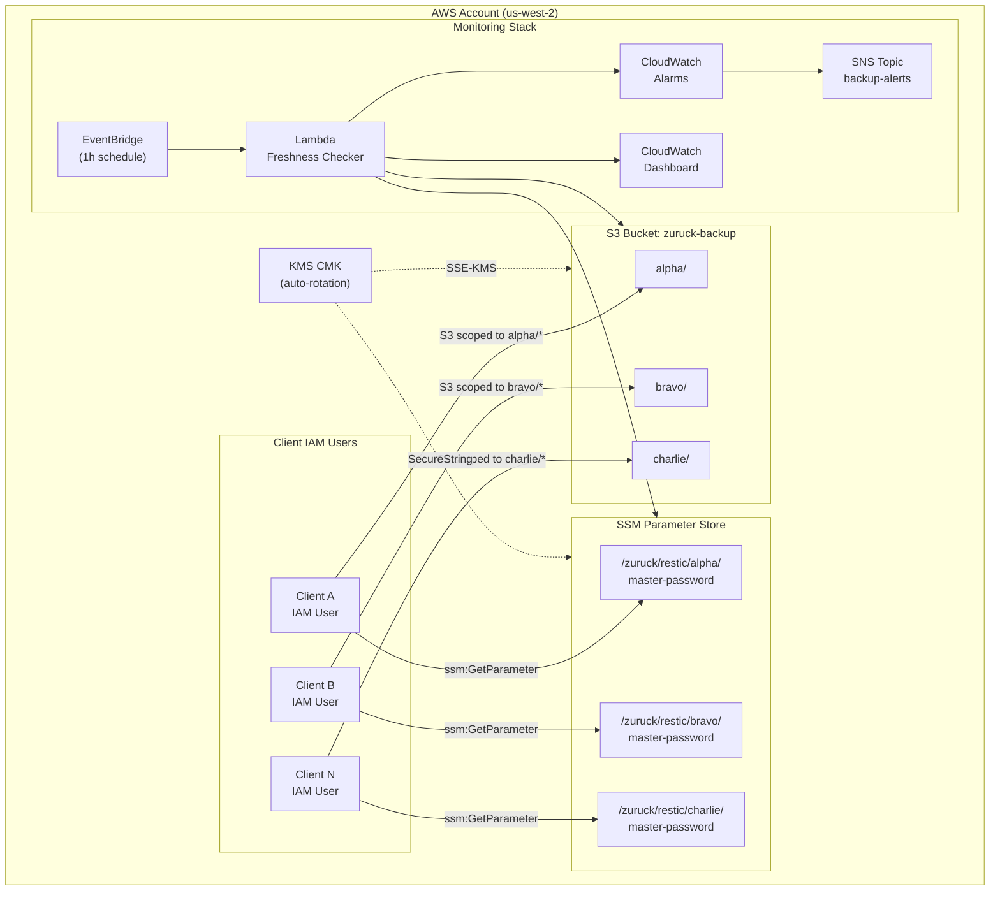

# Zuruck — Restic S3 Backup System

AWS CDK project that provisions an S3-based backup backend for [restic](https://restic.net/) with per-client IAM isolation, KMS encryption, lifecycle-based cold storage, and CloudWatch monitoring.

## Architecture



## Quick Start

### Prerequisites

- Node.js 18+
- AWS CLI configured with appropriate credentials
- CDK CLI: `npm install -g aws-cdk`

### Deploy

```bash
# Install dependencies
npm install

# Bootstrap CDK (first time only)
npx cdk bootstrap aws://<ACCOUNT_ID>/us-west-2

# Deploy with alert emails
npx cdk deploy -c alertEmails=you@example.com,team@example.com

# Or deploy without alerts
npx cdk deploy
```

### Add a New Client

1. Edit `lib/config/clients.ts` and add your client:

```typescript
{
  name: 'charlie',
  description: 'Charlie database server',
  freshnessThresholdHours: 12,
}
```

2. Redeploy: `npx cdk deploy`

3. Retrieve the client's access key:

```bash
# AccessKeyId is in the secret's description; SecretAccessKey is the secret value.
aws secretsmanager describe-secret --secret-id zuruck/clients/charlie/access-key
aws secretsmanager get-secret-value --secret-id zuruck/clients/charlie/access-key --query SecretString --output text
```

4. Run the client setup script on the target machine:

```bash
sudo ./scripts/client-setup.sh \
  --client-name charlie \
  --bucket zuruck-backup-<account-id>-<region> \
  --access-key-id AKIA... \
  --secret-access-key abc123... \
  --region us-west-2 \
  --install-restic
```

5. Initialize the restic repository using the master password from SSM

## Project Structure

```
zuruck/
├── bin/zuruck.ts                    # CDK app entry point
├── lib/
│   ├── zuruck-stack.ts              # Main stack (orchestrates constructs)
│   ├── config/clients.ts            # Client definitions
│   ├── constructs/
│   │   ├── backup-bucket.ts         # S3 bucket + lifecycle + encryption
│   │   ├── backup-iam.ts            # IAM users, group, policies per client
│   │   ├── backup-kms.ts            # KMS key for SSE
│   │   ├── backup-secrets.ts        # SSM Parameter Store (SecureString)
│   │   └── backup-monitoring.ts     # Lambda, CloudWatch, SNS, dashboard
│   └── lambda/
│       ├── freshness-checker.ts          # Hourly per-client backup freshness check
│       └── master-password-provisioner.ts # Custom-resource handler that idempotently provisions SSM master passwords at deploy time
├── scripts/
│   └── client-setup.sh              # Client onboarding script
├── docs/
│   ├── plans/backup-system-plan.md  # Architecture plan
│   ├── backup-strategy.md           # Retention + cold storage strategy
│   ├── client-setup-guide.md        # Step-by-step client instructions
│   └── runbook.md                   # Operational runbook
└── test/
    └── zuruck.test.ts
```

## Key Features

| Feature | Implementation |
|---|---|
| **Encryption** | SSE-KMS with customer-managed CMK (auto-rotation) |
| **Isolation** | Per-client IAM users with prefix-scoped S3 policies |
| **Cold Storage** | S3 Standard → Glacier Flexible Retrieval (90d) → Deep Archive (365d) |
| **Retention** | GFS: 7 daily / 4 weekly / 6 monthly / 2 yearly |
| **Master passwords** | SSM Parameter Store (SecureString), generated server-side at deploy time and `RETAIN`ed across `cdk destroy` |
| **Client access keys** | Secrets Manager (`zuruck/clients/{client}/access-key`) — never in CloudFormation outputs |
| **Restic keys** | Dual: client password local to each machine, master password in SSM for DR |
| **Monitoring** | Hourly Lambda freshness checker; alarms for stale backups, Lambda errors, and bucket-size growth across all storage classes |
| **Dashboard** | Per-client freshness, SSM accessibility, and bucket size by storage class |

## Useful Commands

| Command | Description |
|---|---|
| `npm run build` | Compile TypeScript to JS |
| `npm run watch` | Watch for changes and compile |
| `npm run test` | Run Jest unit tests |
| `npx cdk synth` | Generate CloudFormation template |
| `npx cdk diff` | Compare deployed stack with current state |
| `npx cdk deploy` | Deploy stack to AWS |
| `npx cdk destroy` | Tear down the stack |

## Documentation

- [Backup Strategy](docs/backup-strategy.md) — Retention policies, cold storage, and restore procedures
- [Client Setup Guide](docs/client-setup-guide.md) — Step-by-step instructions for client machines
- [Operational Runbook](docs/runbook.md) — Adding/removing clients, emergency restore, key rotation
- [Architecture Plan](docs/plans/backup-system-plan.md) — Full design document with decisions
