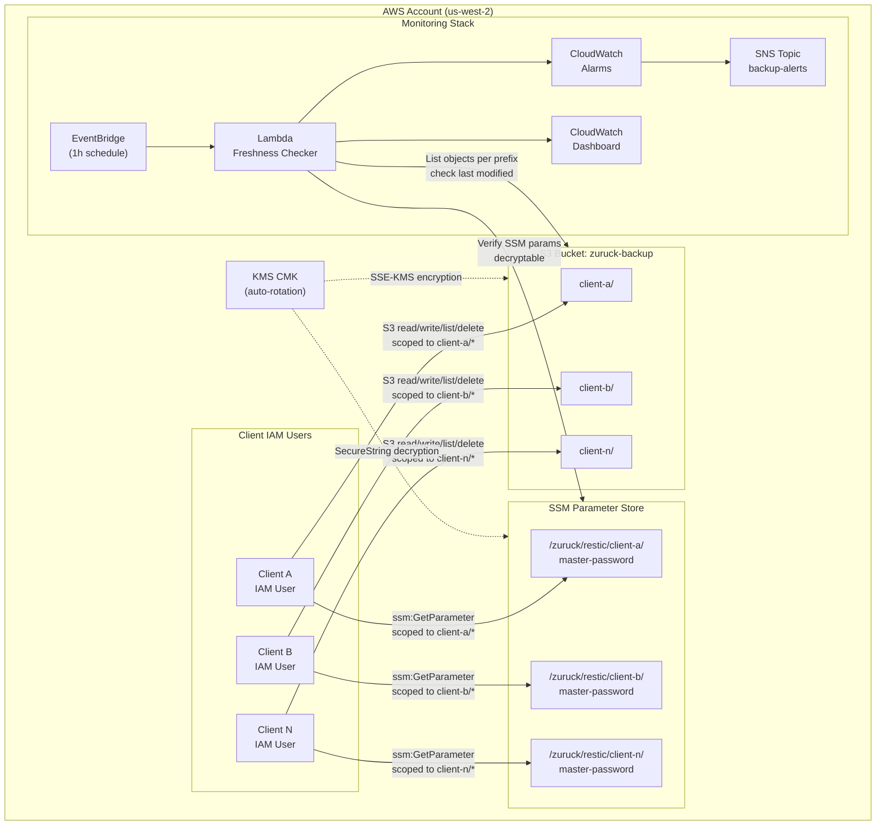
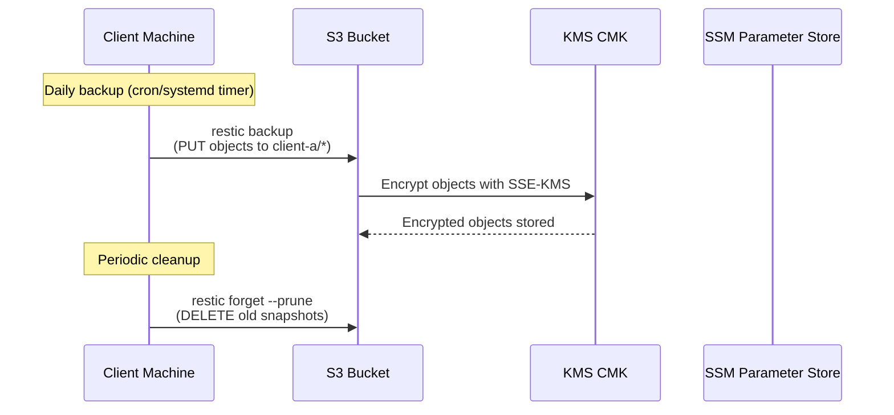
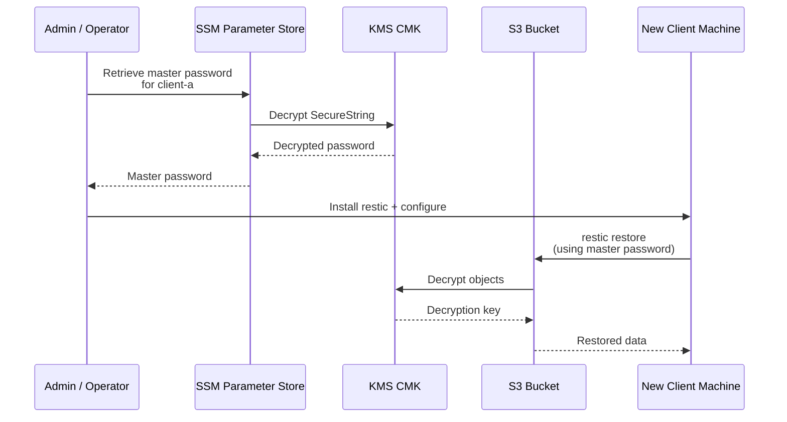
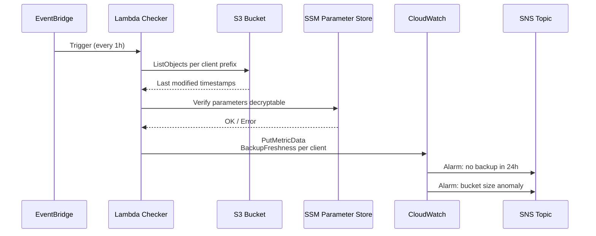

# Plan: CDK Restic S3 Backup System

## Decisions Captured

| Decision | Choice | Rationale |
|---|---|---|
| CDK Language | TypeScript | Requested |
| Client count | 6–20 (medium) | Single bucket with per-client prefixes |
| Cold storage | S3 Standard → lifecycle rules | Auto-transition to Glacier Flexible Retrieval → Deep Archive |
| Retention | GFS: 7 daily / 4 weekly / 6 monthly / 2 yearly | Standard grandfather-father-son strategy |
| Network | Public internet | Simplest, no VPC endpoint costs |
| Monitoring | Full CloudWatch alerting | Lambda freshness checker + SNS + dashboard |
| Region | us-west-2 | Requested |
| Secrets | SSM Parameter Store (SecureString) | Cheaper than Secrets Manager for static passwords |
| Key strategy | Dual restic keys (client + master) | Client never has master password; master key in SSM for DR |

## Architecture Overview

Single S3 bucket with per-client path prefixes (e.g., `client-alpha/`, `client-bravo/`). Each client gets its own IAM user scoped to its prefix. Lifecycle rules transition objects to Glacier Flexible Retrieval after 90 days, then Glacier Deep Archive after 365 days. CloudWatch monitors backup freshness and bucket health.



### Data Flow: Backup Operation



### Data Flow: Emergency Restore



### Data Flow: Monitoring



## AWS Resources

### S3 Bucket
- Versioning enabled
- SSE-KMS encryption (customer-managed KMS key)
- Block public access (all 4 settings)
- Lifecycle rules:
  - Transition to Glacier Flexible Retrieval after 90 days
  - Transition to Glacier Deep Archive after 365 days
  - Expire deleted markers after 7 days
  - Abort incomplete multipart uploads after 7 days
- Object-level S3 event notifications → Lambda for monitoring

### IAM
- Per-client IAM user (programmatic access only)
- IAM policy scoped to `bucket-name/client-prefix/*` (read + write + list + delete for restic forget)
- IAM group "restic-backup-clients" for easier management
- KMS key policy granting decrypt/encrypt to client IAM users
- SSM `GetParameter` permission scoped to `/zuruck/restic/{client}/*`

### KMS
- Customer-managed CMK for S3 SSE
- Key policy: admin = deploying account, users = backup client IAM group
- Automatic key rotation enabled

### SSM Parameter Store
- Per-client SecureString parameter: `/zuruck/restic/{client-name}/master-password`
- Encrypted with the backup KMS key
- Stores the master/admin restic key for each client repo

### CloudWatch + SNS
- SNS topic "backup-alerts" for all notifications
- CloudWatch Alarms:
  - No backup activity per client in 24h (custom metric from Lambda)
  - Bucket total size > threshold (anomaly detection or static)
- Lambda function (triggered by EventBridge scheduled rule every 1h):
  - Lists objects per client prefix, checks last modified time
  - Publishes custom CloudWatch metric `BackupFreshness` per client
  - Verifies SSM parameters exist and are decryptable
- Dashboard: backup health overview

### EventBridge
- Scheduled rule (1h rate) → Lambda for freshness check

## Secrets Architecture

### Approach: SSM Parameter Store (SecureString) + Dual Restic Keys

Each client repo has **two restic keys**:
1. **Client key** — used by the client machine for daily `restic backup` / `restic forget` operations. Stored locally on the client (e.g., `/etc/restic/password`) for zero-latency access during backups.
2. **Master/admin key** — stored in SSM Parameter Store as a SecureString (encrypted with the same KMS key). Used only for emergency restores if the client machine is destroyed. The monitoring Lambda can verify this key exists and is accessible.

### SSM Parameter Layout
- `/zuruck/restic/{client-name}/master-password` — SecureString, encrypted with the backup KMS key
- Each client's IAM policy includes `ssm:GetParameter` scoped to their parameter path

### CDK Resources Added
- SSM Parameters (SecureString) for each client's master key
- IAM policy additions: `ssm:GetParameter` on `/zuruck/restic/{client}/*` for each client IAM user
- KMS key policy: grant `ssm:GetParameter` decrypt to client IAM group
- Lambda monitoring: verify SSM parameters exist and are decryptable

### Client Setup Flow
1. Admin creates client via CDK (adds entry to `clients.ts`, deploys)
2. Admin retrieves IAM access keys for the new client user
3. Admin retrieves master password from SSM (or generates and stores it)
4. Admin runs `restic init` with the master password
5. Admin runs `restic key add` to add a second client-specific password
6. Admin distributes client password to the client machine
7. Client configures `RESTIC_PASSWORD_FILE=/etc/restic/password` for daily operations
8. Master password remains in SSM Parameter Store — never on the client machine

### Why This Approach
- **SSM Parameter Store** is cheaper than Secrets Manager ($0.05/advanced param vs $0.40/secret) and sufficient for static passwords that don't need rotation
- **Dual keys** means the client machine never has the master password — if compromised, admin can `restic key remove` the client key and issue a new one without touching the master key
- **Master key in SSM** ensures disaster recovery: even if the client machine is destroyed, the master key is recoverable from AWS

## CDK Project Structure

```
zuruck/
├── bin/
│   └── zuruck.ts                    # CDK app entry point
├── lib/
│   ├── zuruck-stack.ts              # Main stack (orchestrates constructs)
│   ├── constructs/
│   │   ├── backup-bucket.ts         # S3 bucket + lifecycle + encryption
│   │   ├── backup-iam.ts            # IAM users, group, policies per client
│   │   ├── backup-monitoring.ts     # Lambda, CloudWatch, SNS, dashboard
│   │   ├── backup-kms.ts            # KMS key for SSE
│   │   └── backup-secrets.ts        # SSM Parameter Store (SecureString) per client
│   └── config/
│       └── clients.ts               # Client definitions (name, prefix)
├── scripts/
│   └── client-setup.sh              # Helper script for client onboarding
├── test/
│   └── zuruck.test.ts
├── docs/
│   ├── plans/
│   │   └── backup-system-plan.md    # This plan
│   ├── backup-strategy.md           # Retention + cold storage strategy
│   ├── client-setup-guide.md        # Step-by-step client instructions
│   └── runbook.md                   # Operational runbook
├── cdk.json
├── package.json
├── tsconfig.json
├── .gitignore
├── .npmrc
└── README.md
```

## Implementation Steps

### Phase 1: Project Scaffold
1. Initialize CDK TypeScript project (cdk init, install deps)
2. Create `lib/config/clients.ts` — typed client config interface and default clients array
3. Create `bin/zuruck.ts` — app entry point

### Phase 2: Core Infrastructure (parallel)
4. Create `lib/constructs/backup-kms.ts` — KMS key with rotation + key policy
5. Create `lib/constructs/backup-bucket.ts` — S3 bucket with versioning, SSE-KMS, lifecycle rules, public access block
6. Create `lib/constructs/backup-iam.ts` — IAM group, per-client users, scoped policies (S3 prefix + SSM parameter + KMS grant)
7. Create `lib/constructs/backup-secrets.ts` — SSM Parameter Store SecureString per client for master restic passwords, encrypted with backup KMS key

### Phase 3: Monitoring (depends on Phase 2)
8. Create `lib/constructs/backup-monitoring.ts` — Lambda freshness checker (also verifies SSM parameters are decryptable), CloudWatch metrics/alarms, SNS topic, dashboard
9. Wire EventBridge scheduled rule to Lambda

### Phase 4: Stack Assembly (depends on Phases 2–3)
10. Create `lib/zuruck-stack.ts` — compose all constructs, pass cross-construct references (KMS key → bucket, IAM → KMS, bucket → monitoring, secrets → monitoring)

### Phase 5: Documentation & Client Tooling (parallel with Phase 4)
11. Create `docs/backup-strategy.md` — GFS retention, lifecycle tiers, restic forget schedule
12. Create `docs/client-setup-guide.md` — install restic, configure env vars, init repo, cron/systemd timer
13. Create `scripts/client-setup.sh` — automated client onboarding script
14. Create `docs/runbook.md` — restore procedures, monitoring response, key rotation
15. Create `README.md` — project overview, deploy instructions, architecture diagram

### Phase 6: Verification
16. `cdk synth` — verify CloudFormation template generates correctly
17. `cdk diff` — review changes before deploy
18. Unit test for IAM policy scoping (client A cannot access client B prefix)
19. Unit test for lifecycle rule correctness

## Relevant Files (to create)
- `bin/zuruck.ts` — CDK app entry
- `lib/zuruck-stack.ts` — main stack
- `lib/constructs/backup-kms.ts` — KMS construct
- `lib/constructs/backup-bucket.ts` — S3 + lifecycle construct
- `lib/constructs/backup-iam.ts` — IAM construct
- `lib/constructs/backup-secrets.ts` — SSM Parameter Store construct
- `lib/constructs/backup-monitoring.ts` — monitoring construct
- `lib/config/clients.ts` — client config
- `scripts/client-setup.sh` — onboarding script
- `docs/plans/backup-system-plan.md` — this plan
- `docs/backup-strategy.md` — strategy doc
- `docs/client-setup-guide.md` — client guide
- `docs/runbook.md` — ops runbook

## Verification
1. `cdk synth` produces valid CloudFormation
2. Unit tests pass: IAM policy scoping, lifecycle rule assertions
3. `cdk diff` shows expected resources
4. Manual: deploy to dev account, create test client, run `restic init` + `restic backup` + `restic forget`
5. Verify CloudWatch metrics appear after Lambda runs
6. Verify SNS notification fires when alarm triggers
7. Verify SSM parameters are created and decryptable with the KMS key
8. Verify client IAM user can `ssm:GetParameter` for their own parameter but not others

## Decisions
- Single bucket with prefixes (not per-client buckets) — simpler lifecycle, fewer resources, easier monitoring
- SSE-KMS (not SSE-S3) — audit trail via CloudTrail, customer-managed key rotation
- Glacier Flexible Retrieval at 90d (not 30d) — balances cost vs. restore speed for "warm" backups
- Glacier Deep Archive at 365d — cheapest for yearly compliance retention
- Per-client IAM users (not roles) — clients are external machines without AssumeRole capability
- Lambda freshness checker (not S3 metrics directly) — S3 metrics are bucket-level only; per-client freshness requires custom logic
- SSM Parameter Store (not Secrets Manager) — cheaper for static passwords, sufficient for non-rotating secrets
- Dual restic keys (client key + master key) — client never has master password; master key in SSM for DR

## Further Considerations
1. **Object Lock / WORM** — If compliance requires immutable backups, S3 Object Lock (Governance or Compliance mode) can be added. This prevents `restic forget` from removing snapshots before lock expires. Would require restic prune workflow changes.
2. **Cross-region replication** — For disaster recovery, add S3 CRR to a second region. Adds cost but protects against regional failure.