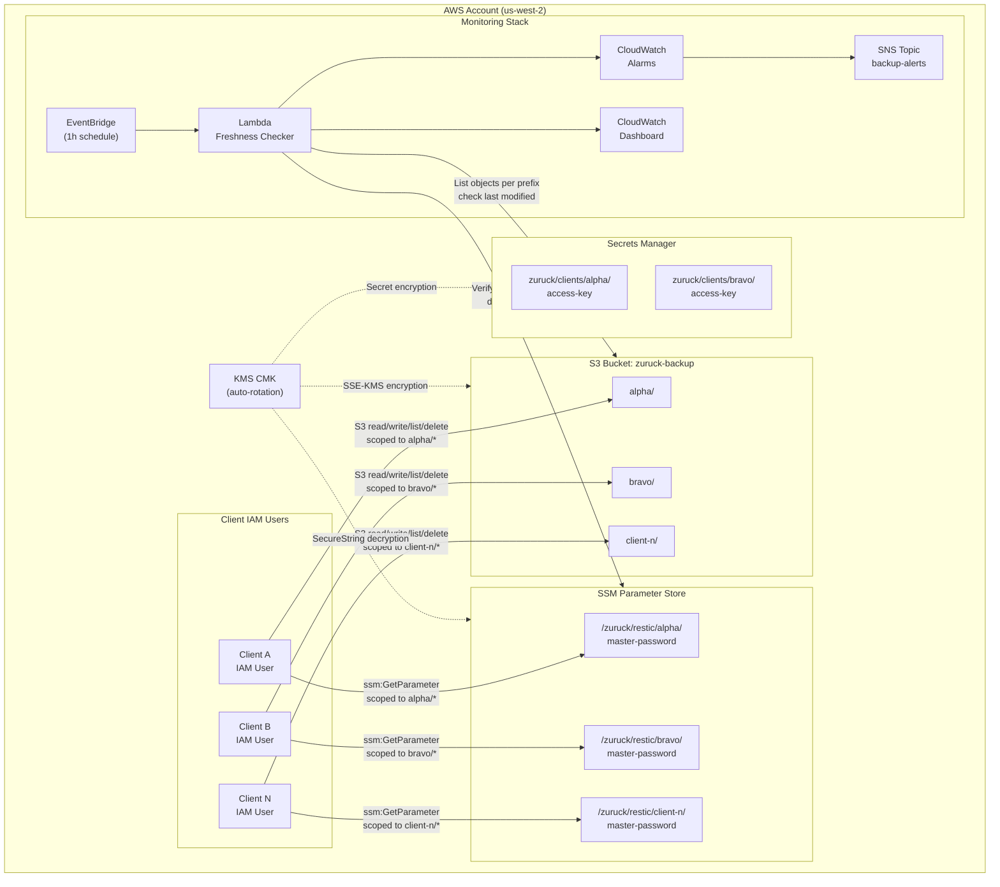
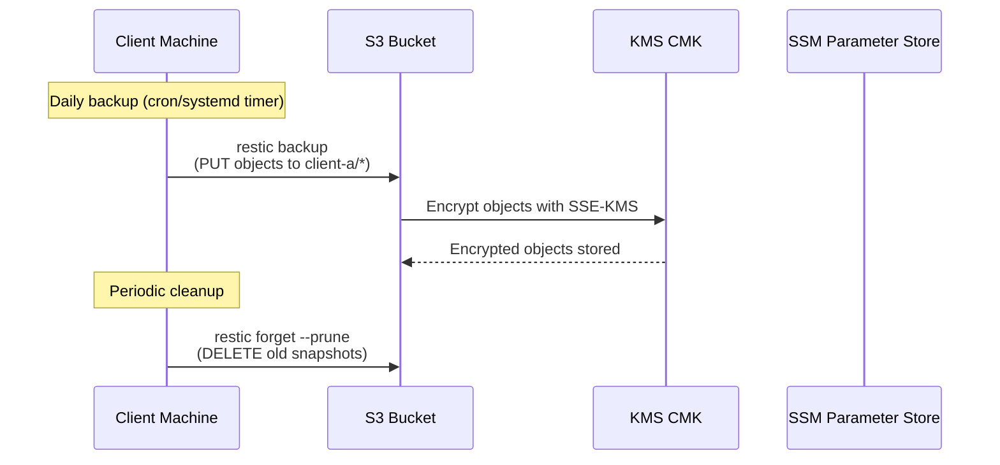
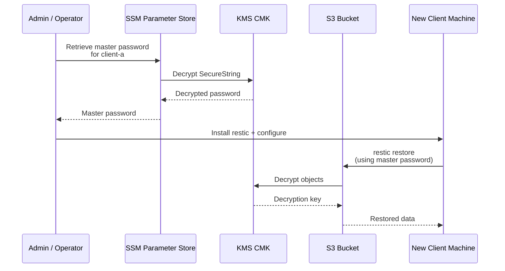
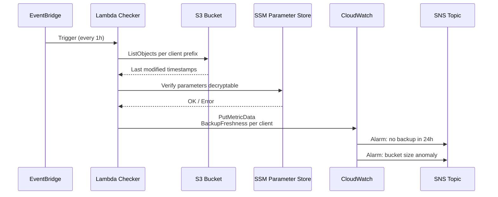

# Plan: CDK Restic S3 Backup System

## Decisions Captured

| Decision | Choice | Rationale |
|---|---|---|
| CDK Language | TypeScript | Requested |
| Client count | 6–20 (medium) | Single bucket with per-client prefixes |
| Cold storage | S3 Standard → lifecycle rules | Auto-transition to Glacier Flexible Retrieval → Deep Archive |
| Retention | GFS: 7 daily / 4 weekly / 6 monthly / 2 yearly | Standard grandfather-father-son strategy |
| Network | Public internet | Simplest, no VPC endpoint costs |
| Monitoring | Full CloudWatch alerting | Lambda freshness checker + SNS + dashboard |
| Region | us-west-2 | Requested |
| Secrets | SSM Parameter Store (SecureString) via Custom Resource | Passwords generated server-side in Lambda, never in CFN template |
| Access keys | Secrets Manager (per-client secret) | Secret access key stored in Secrets Manager, not CFN outputs |

## Architecture Overview

Single S3 bucket with per-client path prefixes (e.g., `alpha/`, `bravo/`). Each client gets its own IAM user scoped to its prefix. Lifecycle rules transition objects to Glacier Flexible Retrieval after 90 days, then Glacier Deep Archive after 365 days. CloudWatch monitors backup freshness and bucket health. Access keys are stored in Secrets Manager (not CFN outputs). Master restic passwords are provisioned via a Custom Resource Lambda that generates random passwords server-side.



### Data Flow: Backup Operation



### Data Flow: Emergency Restore



### Data Flow: Monitoring



## AWS Resources

### S3 Bucket
- Versioning enabled
- SSE-KMS encryption (customer-managed KMS key)
- Block public access (all 4 settings)
- Lifecycle rules:
  - Transition to Glacier Flexible Retrieval after 90 days
  - Transition to Glacier Deep Archive after 365 days
  - Expire deleted markers after 7 days
  - Abort incomplete multipart uploads after 7 days
- Object-level S3 event notifications → Lambda for monitoring

### IAM
- Per-client IAM user (programmatic access only)
- IAM policy scoped to `bucket-name/client-prefix/*` (read + write + list + delete for restic forget)
- IAM group "restic-backup-clients" for easier management
- KMS key policy granting decrypt/encrypt to client IAM users
- SSM `GetParameter` permission scoped to `/zuruck/restic/{client}/*`

### KMS
- Customer-managed CMK for S3 SSE
- Key policy: admin = deploying account, users = backup client IAM group
- Automatic key rotation enabled

### SSM Parameter Store
- Per-client SecureString parameter: `/zuruck/restic/{client-name}/master-password`
- Encrypted with the backup KMS key
- **Provisioned via Custom Resource Lambda** (master-password-provisioner) — passwords are generated server-side using `crypto.randomBytes`, never present in the CloudFormation template
- Idempotent: existing parameters are not overwritten on redeploy, so operator-driven rotations survive
- Removal policy: RETAIN — losing the master password orphans all archived backups

### Secrets Manager
- Per-client secret: `zuruck/clients/{client-name}/access-key`
- Stores the IAM secret access key (the AccessKeyId is in the secret's Description field)
- Encrypted with the backup KMS key
- Operators retrieve via `aws secretsmanager get-secret-value` — never via CFN outputs

### CloudWatch + SNS
- SNS topic "backup-alerts" for all notifications (encrypted with KMS)
- CloudWatch Alarms:
  - Per-client stale backup alarm (BackupFreshness < 1, missing data = breaching)
  - Lambda error alarm (freshness checker itself is failing)
  - Bucket total size > threshold (sums StandardStorage + GlacierStorage + DeepArchiveStorage)
- Lambda function (triggered by EventBridge scheduled rule every 1h):
  - Lists objects per client prefix, checks last modified time
  - Publishes custom CloudWatch metrics per client: BackupFreshness, HoursSinceLastBackup, BackupsExist, ObjectCount, SSMParameterAccessible
  - Verifies SSM parameters exist and are decryptable
  - Timeout guard: bails early and flushes partial metrics if approaching Lambda timeout
  - Retry strategy: standard SDK v3 retry with backoff for S3 throttling
- Dashboard: backup health overview (freshness, SSM accessibility, Lambda errors, bucket size by storage class)

### EventBridge
- Scheduled rule (1h rate) → Lambda for freshness check

## Secrets Architecture

### Approach: SSM Parameter Store (SecureString) + Dual Restic Keys + Secrets Manager for Access Keys

Each client repo has **two restic keys**:
1. **Client key** — used by the client machine for daily `restic backup` / `restic forget` operations. Stored locally on the client (e.g., `/etc/restic/password`) for zero-latency access during backups.
2. **Master/admin key** — stored in SSM Parameter Store as a SecureString (encrypted with the same KMS key). Used only for emergency restores if the client machine is destroyed. The monitoring Lambda can verify this key exists and is accessible.

### SSM Parameter Layout
- `/zuruck/restic/{client-name}/master-password` — SecureString, encrypted with the backup KMS key
- Provisioned via Custom Resource Lambda (master-password-provisioner) — generated server-side, never in template
- Idempotent: existing parameters are not overwritten on redeploy
- Removal policy: RETAIN

### Secrets Manager Layout
- `zuruck/clients/{client-name}/access-key` — stores the IAM secret access key
- AccessKeyId is stored in the secret's Description field (non-sensitive)
- Encrypted with the backup KMS key

### CDK Resources Added
- Custom Resource (Lambda-backed) for each client's SSM master password parameter
- Secrets Manager secret for each client's IAM access key
- IAM policy additions: `ssm:GetParameter` on `/zuruck/restic/{client}/*` for each client IAM user
- KMS key policy: grant `ssm:GetParameter` decrypt to client IAM group
- Lambda monitoring: verify SSM parameters exist and are decryptable
- Lambda error alarm: catches freshness checker failures
- Bucket size alarm: sums across all storage classes (Standard + Glacier + Deep Archive)

### Client Setup Flow
1. Admin creates client via CDK (adds entry to `clients.ts`, deploys)
2. Admin retrieves IAM access key secret from Secrets Manager: `aws secretsmanager get-secret-value --secret-id zuruck/clients/{name}/access-key`
3. Admin retrieves master password from SSM (auto-generated by Custom Resource Lambda): `aws ssm get-parameter --name /zuruck/restic/{name}/master-password --with-decryption`
4. Admin runs `restic init` with the master password
5. Admin runs `restic key add` to add a second client-specific password
6. Admin distributes client password to the client machine
7. Client configures `RESTIC_PASSWORD_FILE=/etc/restic/password` for daily operations
8. Master password remains in SSM Parameter Store — never on the client machine

### Why This Approach
- **SSM Parameter Store** is cheaper than Secrets Manager ($0.05/advanced param vs $0.40/secret) and sufficient for static passwords that don't need rotation
- **Custom Resource Lambda** generates passwords server-side — they never appear in the CloudFormation template or git history, and existing parameters are not overwritten on redeploy
- **Dual keys** means the client machine never has the master password — if compromised, admin can `restic key remove` the client key and issue a new one without touching the master key
- **Master key in SSM** ensures disaster recovery: even if the client machine is destroyed, the master key is recoverable from AWS
- **Secrets Manager for access keys** avoids leaking the secret access key via `cloudformation:DescribeStacks` or CI logs
- **Removal policy RETAIN** on SSM parameters prevents accidental data loss from `cdk destroy`

## CDK Project Structure

```
zuruck/
├── bin/
│   └── zuruck.ts                    # CDK app entry point (region pinning, email validation)
├── lib/
│   ├── zuruck-stack.ts              # Main stack (orchestrates constructs)
│   ├── constructs/
│   │   ├── backup-bucket.ts         # S3 bucket + lifecycle + encryption
│   │   ├── backup-iam.ts            # IAM users, group, policies per client
│   │   ├── backup-monitoring.ts     # Lambda, CloudWatch, SNS, dashboard
│   │   ├── backup-kms.ts            # KMS key for SSE
│   │   └── backup-secrets.ts        # Custom Resource Lambda for SSM master passwords
│   ├── lambda/
│   │   ├── freshness-checker.ts     # Lambda: backup freshness monitoring
│   │   └── master-password-provisioner.ts # Lambda: SSM password provisioning
│   └── config/
│       └── clients.ts               # Client definitions (name, prefix)
├── scripts/
│   └── client-setup.sh              # Helper script for client onboarding
├── test/
│   └── zuruck.test.ts
├── docs/
│   ├── plans/
│   │   └── backup-system-plan.md    # This plan
│   ├── backup-strategy.md           # Retention + cold storage strategy
│   ├── client-setup-guide.md        # Step-by-step client instructions
│   └── runbook.md                   # Operational runbook
├── cdk.json
├── package.json
├── tsconfig.json
├── .gitignore
├── .npmrc                           # save-exact=true for infra deps
└── README.md
```

## Implementation Steps

### Phase 1: Project Scaffold
1. Initialize CDK TypeScript project (cdk init, install deps)
2. Create `lib/config/clients.ts` — typed client config interface and default clients array
3. Create `bin/zuruck.ts` — app entry point

### Phase 2: Core Infrastructure (parallel)
4. Create `lib/constructs/backup-kms.ts` — KMS key with rotation + key policy
5. Create `lib/constructs/backup-bucket.ts` — S3 bucket with versioning, SSE-KMS, lifecycle rules, public access block
6. Create `lib/constructs/backup-iam.ts` — IAM group, per-client users, scoped policies (S3 prefix + SSM parameter + KMS grant)
7. Create `lib/constructs/backup-secrets.ts` — Custom Resource Lambda for SSM master password provisioning (server-side generation, idempotent, RETAIN on deletion)
8. Create `lib/lambda/master-password-provisioner.ts` — Lambda handler for SSM password provisioning
9. Create `lib/lambda/freshness-checker.ts` — Lambda handler for backup freshness monitoring (timeout guard, retry strategy)

### Phase 3: Monitoring (depends on Phase 2)
8. Create `lib/constructs/backup-monitoring.ts` — Lambda freshness checker (also verifies SSM parameters are decryptable), CloudWatch metrics/alarms (per-client freshness, Lambda errors, bucket size across all storage classes), SNS topic, dashboard (freshness + SSM + Lambda errors + bucket size)
9. Wire EventBridge scheduled rule to Lambda

### Phase 4: Stack Assembly (depends on Phases 2–3)
10. Create `lib/zuruck-stack.ts` — compose all constructs, pass cross-construct references (KMS key → bucket, IAM → KMS, bucket → monitoring, secrets → monitoring). Per-client Secrets Manager secrets for access keys (not CFN outputs).

### Phase 5: Documentation & Client Tooling (parallel with Phase 4)
11. Create `docs/backup-strategy.md` — GFS retention, lifecycle tiers, restic forget schedule
12. Create `docs/client-setup-guide.md` — install restic, configure env vars, init repo, cron/systemd timer
13. Create `scripts/client-setup.sh` — automated client onboarding script
14. Create `docs/runbook.md` — restore procedures, monitoring response, key rotation
15. Create `README.md` — project overview, deploy instructions, architecture diagram

### Phase 6: Verification
16. `cdk synth` — verify CloudFormation template generates correctly
17. `cdk diff` — review changes before deploy
18. Unit test for IAM policy scoping (client A cannot access client B prefix — negative assertion)
19. Unit test for lifecycle rule correctness
20. Unit test for SSM parameter name pattern
21. Unit test for Lambda environment variables
22. Unit test for stale-backup alarm triggerability (threshold + comparison operator)
23. Unit test for no CHANGE-ME- in synthesized template
24. Unit test for no access keys in CFN outputs

## Relevant Files (to create)
- `bin/zuruck.ts` — CDK app entry
- `lib/zuruck-stack.ts` — main stack
- `lib/constructs/backup-kms.ts` — KMS construct
- `lib/constructs/backup-bucket.ts` — S3 + lifecycle construct
- `lib/constructs/backup-iam.ts` — IAM construct
- `lib/constructs/backup-secrets.ts` — Custom Resource Lambda for SSM master passwords
- `lib/lambda/freshness-checker.ts` — Lambda: backup freshness monitoring
- `lib/lambda/master-password-provisioner.ts` — Lambda: SSM password provisioning
- `lib/constructs/backup-monitoring.ts` — monitoring construct
- `lib/config/clients.ts` — client config
- `scripts/client-setup.sh` — onboarding script
- `docs/plans/backup-system-plan.md` — this plan
- `docs/backup-strategy.md` — strategy doc
- `docs/client-setup-guide.md` — client guide
- `docs/runbook.md` — ops runbook

## Verification
1. `cdk synth` produces valid CloudFormation
2. Unit tests pass: IAM policy scoping, lifecycle rule assertions, SSM parameter name pattern, Lambda env vars, alarm triggerability, no secrets in outputs
3. `cdk diff` shows expected resources
4. Manual: deploy to dev account, create test client, run `restic init` + `restic backup` + `restic forget`
5. Verify CloudWatch metrics appear after Lambda runs
6. Verify SNS notification fires when alarm triggers
7. Verify SSM parameters are created and decryptable with the KMS key
8. Verify client IAM user can `ssm:GetParameter` for their own parameter but not others

## Decisions
- Single bucket with prefixes (not per-client buckets) — simpler lifecycle, fewer resources, easier monitoring
- SSE-KMS (not SSE-S3) — audit trail via CloudTrail, customer-managed key rotation
- Glacier Flexible Retrieval at 90d (not 30d) — balances cost vs. restore speed for "warm" backups
- Glacier Deep Archive at 365d — cheapest for yearly compliance retention
- Per-client IAM users (not roles) — clients are external machines without AssumeRole capability
- Lambda freshness checker (not S3 metrics directly) — S3 metrics are bucket-level only; per-client freshness requires custom logic
- SSM Parameter Store (not Secrets Manager) — cheaper for static passwords, sufficient for non-rotating secrets
- Dual restic keys (client key + master key) — client never has master password; master key in SSM for DR

## Further Considerations
1. **Object Lock / WORM** — If compliance requires immutable backups, S3 Object Lock (Governance or Compliance mode) can be added. This prevents `restic forget` from removing snapshots before lock expires. Would require restic prune workflow changes.
2. **Cross-region replication** — For disaster recovery, add S3 CRR to a second region. Adds cost but protects against regional failure.